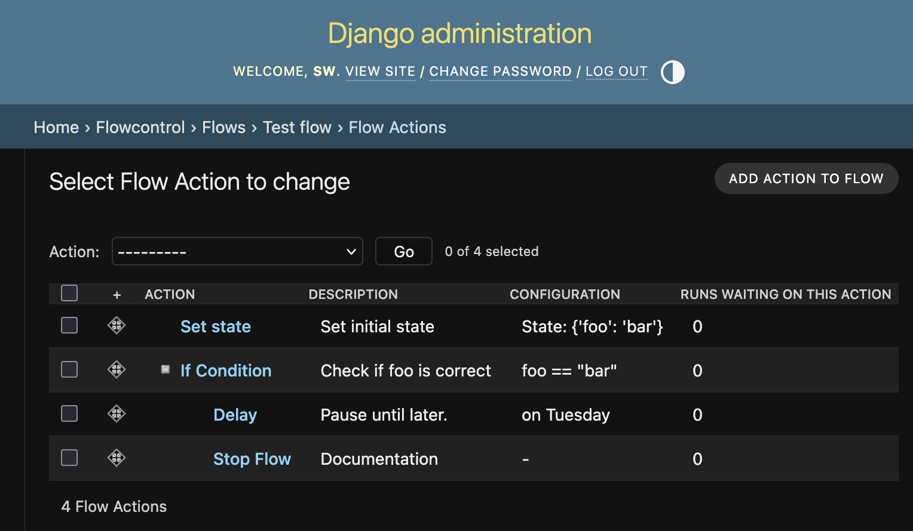

# Django-Flowcontrol

Django Flowcontrol is a Django app that allows creating and running flows of actions including branching and looping logic.

- Actions are defined in Python code and can have optional per-instance configuration. The app provides built-in actions for conditional logic, loops, and state management.
- Flows with their actions and triggers are defined in the Django admin.
- A running instance of a flow – a flow run – has persistent state and can have an optional model object associated with it.



## Install

    pip install django-flowcontrol

Add `flowcontrol` and `treebeard` to your `INSTALLED_APPS` in `settings.py` and make sure to include the other required Django apps:

```python
INSTALLED_APPS = [
    ...
    # Required Django apps
    "django.contrib.auth",
    "django.contrib.admin",
    "django.contrib.contenttypes",
    "django.contrib.sessions",
    "django.contrib.messages",
    "django.contrib.humanize",  # for number formatting
    ...

    "treebeard",
    'flowcontrol',

    ...
]
```

Run migrations to create the necessary database tables:

```
python manage.py migrate flowcontrol
```

## Run the example project

To run the example project, clone the repository and install the dependencies:

```bash
uv run manage.py migrate
uv run manage.py createsuperuser
uv run manage.py runserver
```

Go to [http://localhost:8000/admin/](http://localhost:8000/admin/) and log in with the superuser credentials you created.

## License

MIT
